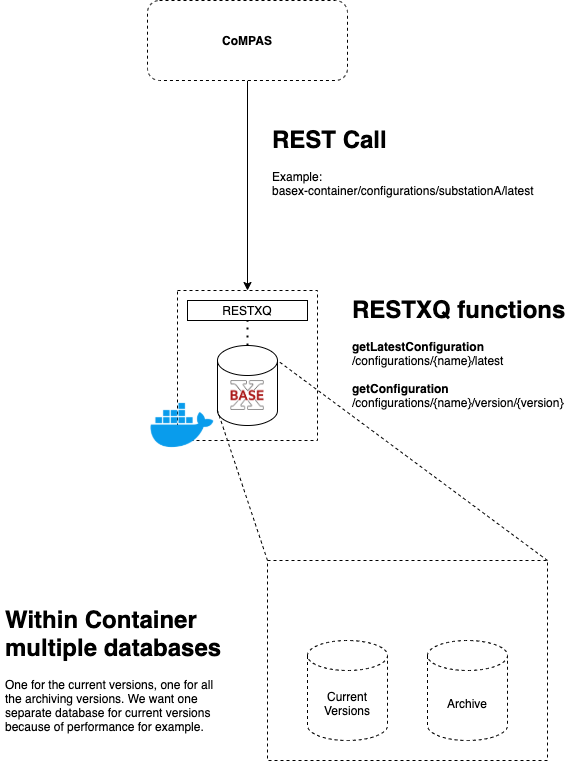
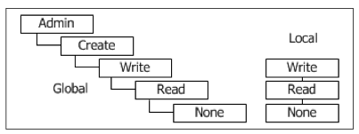

## Database Management

## Versioning Overview


To achieve versioning (which is not available out-of-the-box), we need to add something smart to BaseX. This smart thing is [RESTXQ](http://exquery.github.io/exquery/exquery-restxq-specification/restxq-1.0-specification.html) in our case.

With RESTXQ, functions can be created using xQuery and some added intelligence like variables and for-loops for example.

Example RESTXQ function:

```
declare
  %rest:path("/search")
  %rest:query-param("term", "{$term}")
  %rest:single
function page:search($term as xs:string) {
  <ul>{
    for $result in db:open('large-db')//*[text() = $term]
    return <li>{ $result }</li>
  }</ul>
};
```

By using RESTXQ, a versioning mechanism can be created. So for example, in a edit (PUT) function we can do something like: When editing a already stored configuration, save it by incrementing the version and store as a separate configuration. The old configuration is stored in the archive database, the current version is replaced in the current database.

In a get (GET) function, we can make distinction between newer and older versions using RESTXQ. By using xQuery syntax (scl[@version="1"] for example), we can get specific versions of a configuration.

### Versioning type
For type of versioning, we prefer [Semantic Versioning](https://semver.org/). This to keep versioning simple. For every changeset CoMPAS is going to ask if it's a major, minor or a patch. This way the version will be adjusted according to the user's needs. An example of distinction can be:
- A changeset is Major in case a full XML section is being added.
- A changeset is Minor is a piece of data is adjusted.
- A changeset is a Patch if a typo is fixed.
But this is up to the user.

Saving the version will be done in combination with the History section (tHitem) of the SCL structure. This history section contains multiple history items, so you can create a provenance section. Please checkout the [Provenance](#provenance-overview) section for more information. Key point is: a tHitem contains the following attributes:
- Version
- Revision
- When
- Who
- What
- Why

This creates provenance, and version is one of them. The version attribute will be used for the latest version.

Another solution could be [Branch Based Versioning](https://simon-maxen.medium.com/branch-based-versioning-5ebf6ca2bccb). This way, a configuration file can be 'branched', and can be 'merged' when the user think it's fine. When merging, a newer version number can be added (can be done in combination with semantic versioning).
This in indeed a fancy way of versioning, but it's too complex for our use cases. We don't see users branching a configuration file and saving it for a couple of days, before merging it. Besides, this kind of versioning isn't supported in BaseX out of the box so we have to create it ourselves. When comparing added value to effort, this isn't what we want.

## Tech Talk

### Points to remember
- home of BaseX = /srv/basex
- RESTXQ file extension = .xqm
- RESTXQPATH variable (in {home}/webapp/WEB-INF/web.xml) points to directory containing the RESTXQ modules (.xqm files)
  - Default is '.', which is relative to the WEBPATH variable (which is {home}/webapp)

### Example using RESTXQ

- Run a BaseX container
- Use shell inside container (docker exec -it <container id> bash)
- create a RESTXQ module: vi /srv/basex/webapp/test.xqm for example
- copy paste the following code:

```
module namespace page = 'http://basex.org/examples/web-page';

declare %rest:path("hello/{$who}") %rest:GET function page:hello($who) {
  <response>
    <title>!Hello { $who }!</title>
  </response>
};
```

- You don't have to restart the container, when doing a REST request it seaches on the fly for functions.
- Do a GET request like http://localhost:8984/hello/World
- You will get a XML containing a title !Hello World!

### Restrictions
A single database is restricted to 2 billion nodes (also, see [BaseX Statistics](https://docs.basex.org/wiki/Statistics))
A node in this case is an XML node like an element, attribute, text, etc.

### Sources
http://www.adamretter.org.uk/presentations/restxq_mugl_20120308.pdf

## Database Rights
In a microservice architecture, a microservice's database should be part of the implementation of that service and cannot be accessed directly by other services. This way, the service is loosely coupled and can be developed/scaled/deployed independently.

There are some patterns to keep persistent data private:
- private-tables-per-service
- schema-per-service
- database-server-per-service
As seen, 2 options are not available for BaseX because it's not a relational database. It doesn't have tables or schemas.
A Database-server-per-service pattern helps ensure that the services are lossely coupled.

The CIM - IEC 61850 service for example get's their own database. If another service wants to get SCD files from this service, use the API of that particular service.

### Where do we set the user privelages of Basex?
Basex has it's own [User Management](https://docs.basex.org/wiki/User_Management).

It's pretty straight forward: Basex has Users that can be created. These users can have so-called permissions that can be applied to the user:


In this overview, we see 'Global' permissions and 'Local' permissions.
In both permission groups, a higher permission includes all lower permissions. So a user with the 'Create' permission also has the 'Read' permission.

All permissions are stored in a file called users.xml (which can be editted manually) inside the database directory, and is being parsed once BaseX is started.

### How do we connect BaseX with a central identity repository/application?
BaseX doesn't have compatibility with a central identity repository (like Keycloak) out of the box available, but after discussing it with the BaseX community it's pretty comfortable to achieve this with RESTXQ or xQuery. There are examples available for making use of Keycloak:

[Example with xQuery](https://code-repo.d4science.org/gCubeSystem/d4science-keycloak-themes/src/branch/master/src/utils/xquery)

[Example with RESTXQ](./blob-files/code_examples/auth_sk.xqm)

Full attached description about this example:

>I attach here an example of an OIDC code grant flow implemented with RestXQ, BaseX permission and error handler.
The file includes a sort of library for performing the steps of the OIDC flow plus a minimal application that is registered as public client inside keycloak and which is what you should access from your browser by calling http://localhost:8984/authtest or http://localhost:8984/authtest/internal.
I've put into it also the logout procedure for performing the back-channel logout which closes the SSO session.
This is only a resume of a more generic and complex module but it should be useful as a howto and it should be as simple to install as copying the file to your BaseX' webapp folder. Use it as you like.

### Is direct database access allowed within the microservices architecture?
For maintenance for example, it's of course allowed to have direct database access. There is no best practice available for this. For some things, you just need direct database access.

If other microservices need access to the data of an other microservice, the only way (best practice) to do this is by API calls.

Source:
https://microservices.io/patterns/data/database-per-service.html

## Provenance Overview
If the generation of a substation fails for example, we would like to know the provenance of the file.
This way it's easier to get the cause.

### W3 PROV
Provenance is information about entities, activities, and people involved in producing a piece of data or thing, which can be used to form assessments about its quality, reliability or trustworthiness. The PROV Family of Documents defines a model, corresponding serializations and other supporting definitions to enable the inter-operable interchange of provenance information in heterogeneous environments such as the Web. This document provides an overview of this family of documents. (https://www.w3.org/TR/prov-overview/#Abstract)

W3C does have a full standard for extending files with provenance information, in such a way that it's standardized and it enables the interchangable of provenance information in environments such as, in our case, XML environments. The design of PROV is based on the recommendations of the [Provenance Incubator Group](https://www.w3.org/2005/Incubator/prov/charter).

### W3 PROV-XML
One of the documents of W3 PROV is PROV-XML. This document converts the PROV standard to XML definitions, and is what we want.
PROV-XML has 6 components to use:
- component 1: entities and activities, and the time at which they were created, used, or ended;
- component 2: derivations of entities from others;
- component 3: agents bearing responsibility for entities that were generated and activities that happened;
- component 4: bundles, a mechanism to support provenance of provenance;
- component 5: properties to link entities that refer to a same thing;
- component 6: collections forming a logical structure for its members.

The component we're most interested in, is component 1. And especially the activities.
There is a [Activity complexType](https://www.w3.org/TR/2013/NOTE-prov-xml-20130430/#term-Activity) defined. An Activity in PROV-XML is defined as:

> something that occurs over a period of time and acts upon or with entities; it may include consuming, processing, transforming, modifying, relocating, using, or generating entities.
> 
This is how we can interpret a edit on a XML file: as an activity.

An activity has a start- and endtime. In our case, that can be the period from opening the file to saving the file. It has a type or activity, which will most of the time be an Edit.

And a set of extra attributes can be added. In the added example, an hostname is added. In our case that's not very handy, because if CoMPAS is runned locally, the hostname doesn't say that much. What makes the most sense at this point is adding a User attribute which is linked to the future oAuth 2.0 authorisation/authentication module.

Example of added PROV section. The UserID attribute is a simplified attribute for identifying the entity doing the activity:
```xml
<prov:document
    xmlns:xsi="http://www.w3.org/2001/XMLSchema-instance"
    xmlns:xsd="http://www.w3.org/2001/XMLSchema"
    xmlns:prov="http://www.w3.org/ns/prov#"
    xmlns:ex="http://example.com/ns/ex#">

  <prov:activity prov:id="ex:a1">
    <prov:startTime>2021-03-16T16:05:00</prov:startTime>
    <prov:endTime>2021-03-16T16:08:00</prov:endTime>
    <prov:type xsi:type="xsd:QName">ex:edit</prov:type>
    <ex:userId>123456</ex:userId>
  </prov:activity>

</prov:document>
```

### IEC-61850-6 hItem (History)
A second option is the History section of a SCL file.
This section is a standard section of a SCL and contains the following fields:
- version
- revision
- when
- who
- what
- why

As you can see, this can be done in combination with [versioning](#versioning-overview).
This is enough for the basic usage that we need. For every version (every edit for example), a new hItem will be added to the SCL.
This way, we don't need to extend the SCL by default. We can just use the standard.

### Final Thoughts
The best way is to use the History section of a SCL file.
It's flexible enough for our basic needs, so we got the version, the when, the who, etc.

In the future it's possible that we need to need something extra, for example an origin CIM file from conversion.
For this we can use the W3C PROV-XML section.
In this case, we can extend the History item with so-called 'private' data, which will be the W3C PROV-XML data.

### Sources
https://www.w3.org/TR/prov-xml
