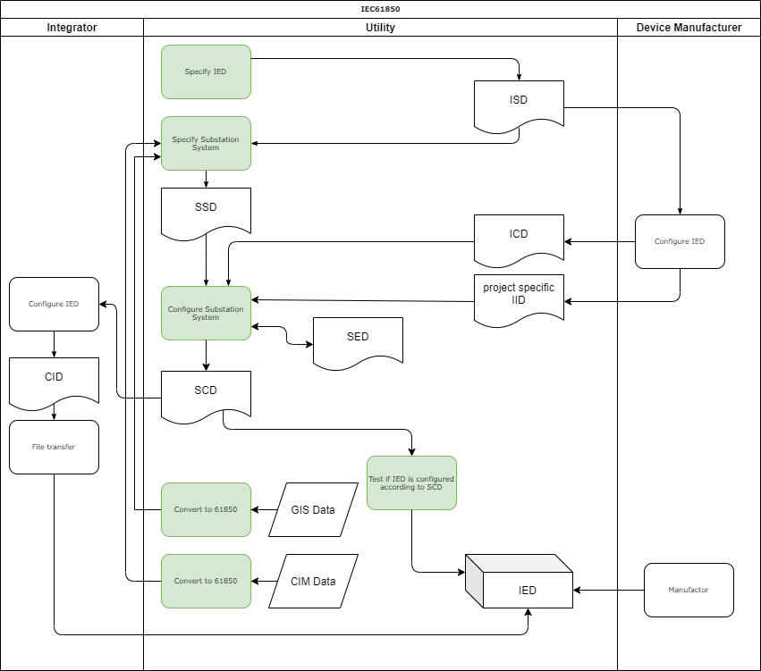
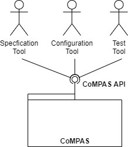
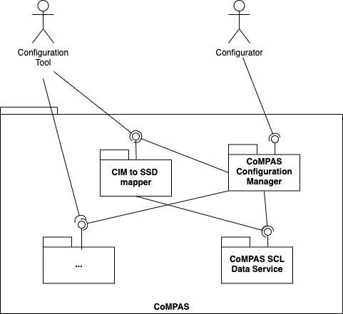

## Functional architecture

### Introduction
This page desribes the functional architecture of CoMPAS. CoMPAS provides software components related to IEC 61850 model implementation, specifically for profile management and configuration of a power industry Protection Automation and Control System (PACS). It describes the logical decomposition.

### The IEC61850 standard
The IEC61850 standard describes the process and tooling for substation automation. The processes describes the designing and deploying substation automation.

| Process | Description |
| --- | --- |
| **Specify IED** | With this process the Utility specifies the required IED in an ISD file. This profile is input for the manufacturer to deliver the required IED |
| **Specify Substation System** | With this process the Utility specifies the substation system in an SSD file. For example, this specification may be done based on CIM data existing with the Utility |
| **Configuration Substation System** | With this process the Utility configures the substation. This results in the SCD file. Aditional inputs for this process are the IID file (IED configuration) and SED file (interfacing with other projects) |
| **Configure IED** | The process of configuring the IED. This results in an instantiated IED IID file. The process is manufacturer specific. It results in either an ICD file or IID file. It is used to convert the SCD to a manufacturer specfic CID file to be sent to the IED |
| **Test** | The fully configured IED can be tested against the SCD and SSD files |
| **Convert CIM/GIS to IEC61850 SLD** | CIM or GIS can te used to convert to 61850 configuration files |

Refer to the [Glossary](GLOSSARY.md) for the abbreviations and various 61850 file types.

The green indicated process are in scope for CoMPASS.

### CoMPAS architecture
#### Context

The diagram shows the context of CoMPAS. CoMPAS offers a set of IEC61850 services disclosed by a REST API that can be used to create tooling for specification, configuration, deployment and testing of substations.

#### First level of decomposition

This diagram shows the services within CoMPAS. Currently following (micro)services are provisioned:

| Service | Description |
| --- | --- |
| [**CIM to SSD Mapper**](CIM_61850_MAPPING.md) |  A service that maps a CIM representation of a substation to an IEC61850 System Specification Description (SSD) file |

_**More services to be added**_

### Microservice architecture
CoMPAS will consist of a number of microservices that can be used to build substation configuration tools according to IEC61850. In this situation a microservice architecture is chosen because of
* CoMPAS will provide reusable components
* The development will be open source, therefore by multiple development teams. Since microservices are loosly coupled and independent this will fit.
* Microservices are independently deployable and testable

The diagram shows the generic structure of a microservice. It consists of following layers:

| Layer | Description |
| --- | --- |
| **Resources** |  Implements the REST API |
| **Service** | Implements the business logic of the service |
| **Service Entities** |  Business entities within the service |
| **Data** | Data layer is responsible for access to storage or other services |
| **Data Entities** | Entities corresponding to the data storage of external services |

We adhere to the microservice architecture by applying following rules:
* Microservices are developed independently
* If a microservice requires storage (e.g. a database), it will be part of the microservice
* If some central data store is required, it must be disclosed by a microservice that can be used by the other microservices.

### Design decisions
This section describes a number of design decisions

**REST APIs**:
The microservice offers a REST API that presents the service. The IEC61850 services consists of various data conversions that may take time. The conversion is executed within the scope of the REST call. This means a REST call may take time.

**REST Security**:
Https will be used for the REST calls. Data transferred by the calls must be regarded as confidential and therefore must be protected against data disclosure. Microservices must therefore be provided with a certificate. When all microservices and the Configuration Tool are deployed within the same namespace, it is allowed to use http.

For the moment no authentication and authorization is used for the REST APIs. If authenitation/authorization is required in a later stage (for example, if substation configuration is stored by the microservices), it shall be OAuth 2.0 Code grant flow. 
The user logs in on the Configuration Tool and obtains a code and token (preferably a Java Web Token (JWT)). The token is used to access the microservices as a resource.
This requires an OAuth server.

**Deployment**:
Microservices will be deployed as docker container

**Scalability and redundancy**: 
It must be possible to deploy multiple instances of a microservice. We won't expect that scalability will be an issue. Availability might be an issue requiring redundant instances.

