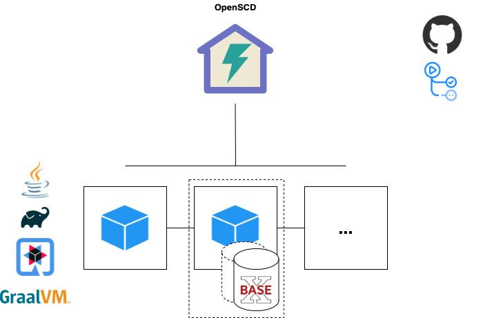

<!--
SPDX-FileCopyrightText: 2021 Alliander N.V.

SPDX-License-Identifier: CC-BY-4.0
-->

# Technology

This page lists the technologies and tools chosen for the project

# Technology Choices
## Programming language - Java
Java 11 is chosen as programming language. 
- Java is well known in the energy sector
- Developers are available
- Java is familiar within LFE projects

## Java build environment - Gradle
For building the applications we use Gradle. Gradle is good suppored in CI/CD.

## Microservice deployment - Docker
Microservices are deployed as Linux based Docker container. Advantages of deployment in Docker container:

- Deployment is independent of deployment platform/OS
- Well supported for cloud deployment
- Tooling readily availabe
- Open source
- Scalable, redundant
- Images can be distributed easily

## Database - BaseX
For the database BaseX](https://basex.org/) is chosen on following arguments:

**Pros**
- Native XML database
- Fully Open Source
- BSD license
- Easy to setup using available Docker image
- Cross-platform available
- Active community
- Multiple API's, like REST(ful) and HTTP
- [ACID guarantees](https://docs.basex.org/wiki/Transaction_Management)
- Many [usage examples](https://docs.basex.org/wiki/Clients) available in different programming languages

**Cons**
- No clear use cases using BaseX
- Versioning is not out-of-the-box available. Need to use a second database to create 'versioning', which creates an archive database and a current database. And by using RESTXQ is relatively easy to create a versioning mechanism. BaseX gave [SirixDB](https://sirix.io/) as a good alternative in case we want a NoSQL database with versioning mechanism.

## XML Processing 
### XML Validation

**Schematron**

SCL XSD is the base schema for the SCL file validation. Even though, with XSD 1.1, it's somehow possible to define co-occurrence constraints with tags "key", "keyref" (combined with xpath selector) and restriction rules with "assert" (within a type definition), that is not enough to expressed complex and custom business logics. 

Schematron is a rule-based validation language for making assertions about the presence or absence of patterns in XML trees. One doesn't need heavy environment to use Schematron. 
Schematron is XML, uses xml technologies (XPATH) and is very straightforward (less than seven basic elements)
It has features for XML processing that other schema validators don't have:
- inter-document constraints validation, 
- hint to fix file under validation.
- Phase/Profile validation
- Abstract rules definition that can be extended (inheritance)
- Embeddable in XSD and Relax NG schema
- etc.

It's optimally used in combination with XML schema (XSD, RELAX NG). 

### Java frameworks for XML processing
**Pros JAXB**
- JAXB (Java Architecture for XML Binding) is a framework that allow mapping Java classes to XML representations
- Memory efficient (for more information, take a look at the comparison in [CIM - 61850 Mapping technologies](./CIM_61850_MAPPING_MVP.md))
- Uses the XJC tool available in the JDK, that compiles an XML schema file into Java classes annotated with JAXB annotations suitable for (un)marshalling. This way, a XML file can be easily build by inserting data into the models.

**Cons JAXB**
- JAXB was part of the Java language, but has been removed from the language since Java version 11. To use it, you have to add an extra dependency.
- Dealing with large documents is not straightforward (cf. [JAXB user guide](https://javaee.github.io/jaxb-v2/doc/user-guide/ch03.html#unmarshalling-dealing-with-large-documents).) 

### Java libraries for schematron

- [schematron-ant](https://github.com/Schematron/ant-schematron)
- [schematron-basex](https://github.com/Schematron/schematron-basex)
- [schematron-exist](https://github.com/Schematron/schematron-exist)
- [ph-schematron](https://github.com/phax/ph-schematron/wiki)
- [apache camel](https://camel.apache.org/components/3.7.x/schematron-component.html) for enterprise integration pattern environment

**Other supports for Schematron specification**

- [lxml](https://lxml.de/) (Python library)
- libxml2 (C XML library)

### RDF4J for IEC CIM configuration files 

**Pros RDF4J**
- Java library for querying RDF(XML) files
- Well known in the Java community
- Not having to re invent the wheel of processing incoming IEC CIM configuration files

**Cons RDF4J**
- If you don't have experience with triples, it might take a while before understanding it all.

## Java framework - Quarkus
For the framework to be used with Java we choose [Quarkus](https://quarkus.io/).

**Pros**
- Java stack, and working experience is available in the community
- Open Source
- Hot reload for quick development
- Less verbose code when developing REST API's, compared to for example Java Spring
- Tailored for GraalVM (universal VM), which is also very interesting for us (usage of resources)
- Huge decrease of memory huge compared to traditional cloud-native stacks like Java Spring.
- Huge decrease in response times compared to traditional cloud-native stacks like Java Spring.
- Backed by RedHat
- Quickly settings up microservices with REST APIs

When looking at the memory usage (and response times) of Quarkus, it's definitely interesting for us. Also take a look at this [comparison with Java Spring](https://simply-how.com/quarkus-vs-spring-boot-production-performance)

Because CoMPAS is an application which also should run locally, memory usage is an important aspect. Together with being a modern microservice framework, backed by RedHat and being a Java framework (which we are having experience with) it's the best choice for now!

**Cons**
- Doesn't support full set of some EE standards, like Enterprise JavaBeans. Expected is that it's not a game breaker for us.
- Relatively new technology, framework could contain some "rookie mistakes". On the other hand, multiple researches are stating the maturity of the framework it achieved in this short time.
- Not many developers are acquainted with Quarkus compared to e.g. the [Spring framework](https://spring.io/).

## Source control - Github
We choose github for source control. This is good practice for open source development. 
The CoMPAS repositories can be found at [https://github.com/com-pas/](https://github.com/com-pas/) 

## CI/CD - Github actions
We choose [Github Actions](https://github.com/features/actions) as mechanism for CI/CD. 

**Pros**
- Upcoming tool, really active in developing
- Free tool for public Github repositories (which CoMPAS is)
- Integrates perfectly with Github repositories

**Cons**
- Software is proprietary
- Adoption is growing within Alliander

# Tool advise
This section lists the development tooling that is *advised*. Of course developers are free to use their own developement tooling

## SDE - Microsoft Visual Studio Code
[Microsoft Visual Studio Code](https://code.visualstudio.com/) is a versatile develpment environment supporting many languages. 

