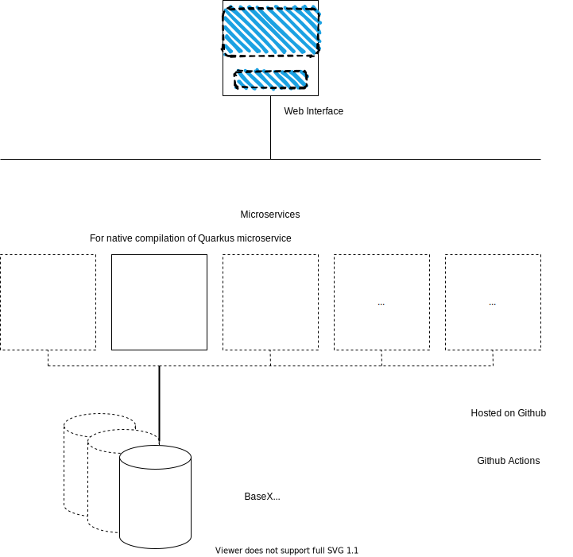

# Technology Choices
The right technology choices are key to a good project.

# Current Technology Choices

# Database
These Databases are evaluated:
- PostgreSQL
- CouchDB
- BaseX
- eXist-db

## Checks for determining database
- Database should be able to store XML data
- Database should be relational, because we need relations between files/pieces of files/models (not sure about this one)
- Database must be provided with the solutions, for example part of a Docker image
- Support must be available, in case of trouble.
- Database must be open-source, because the whole solution must be open-source
- Operations needs to have the ACID guarantees, because the data needs to be reliable and consistent
- Performance isn't a big thing, but it's handy to have a database that performes quick!
- We don't need complex queries, data retrieval is pretty flat

## Document vs Relational Database
There are basically two types of databases: Relational and No-SQL databases.
When to choose one or another can be found on [Microsoft.com](https://docs.microsoft.com/en-us/dotnet/architecture/cloud-native/relational-vs-nosql-data).

## PostgreSQL
Homepage: https://www.postgresql.org/
### Pros
- Open Source, relational database
- PostgreSQL does have XML functions for handling XML files (XMLTABLE)
- XMLTABLE turns XML into a relational table format
- Good support available
- [Docker image](https://hub.docker.com/_/postgres) available
- Does have XML validation when using the XML type field.

### Cons
- Not a native XML database

## CouchDB
Homepage: https://couchdb.apache.org/
### Pros
- The one con we have is decisive.

### Cons
- Cannot store XML as key/property, but as blob. This makes querying a bit challanging.

## BaseX
Homepage: https://basex.org/

### Pros
- Native XML database
- Fully Open Source
- Good license! (BSD)
- Easy to setup using available Docker image
- Cross-platform
- Active community
- Multiple API's, like REST(ful) and HTTP
- [ACID guarantees](https://docs.basex.org/wiki/Transaction_Management)
- Many [usage examples](https://docs.basex.org/wiki/Clients) available in different programming languages

### Cons
- No clear use cases using BaseX
- Versioning is not out-of-the-box available. Need to use a second database to create 'versioning', which creates an archive database and a current database. And by using RESTXQ is relatively easy to create a versioning mechanism. BaseX gave [SirixDB](https://sirix.io/) as a good alternative in case we want a NoSQL database with versioning mechanism.

## eXist-db
Homepage: http://exist-db.org/exist/apps/homepage/index.html
### Pros
- Native XML database
- Fully Open Source
- Cross-platform
- Active community (weekly community call, Slack channels, books)
- Docker image available
- Multiple query languages like HTTP, REST, xQuery and xPath
- Can act like a graph database, so relations between xml fragments for example is possible.
- Supports XML validation (https://exist-db.org/exist/apps/doc/validation.xml)

### Cons
- Using LGPL software is discouraged by Alliander when __modifying__ source code. So if we want to add features to eXist-db in the future, we might have a problem.
- No SQL available (is this needed?)
- Doesn't have all the ACID properties according to [vschart](http://vschart.com/compare/exist-db/vs/postgresql). Isolation is unknown, can't find other sources which confirm this.
- Not well known, no clear use cases in production. There are some [here](http://showcases.exist-db.org/exist/apps/Showcases/index.html)
- eXist needs JRE (Java Runtime Environment) to run

## Final decision
I prefer eXist-db as the database/register for our XML data (based on what we need). It's an open source, cross-platform native XML database with an active community and all the functionality we are looking for.

A second option is using PostgreSQL. A stable, open source RDBMS which can also handle XML using the XMLTABLE functionality. But because it's not the native functionality of PostgreSQL (handling XML), I prefer a native XML database like eXist-db.

My only concern is the maturity of eXist-db. I can't find good use cases of eXist-db, and I'm not sure of the stability in production for example. Let me know if someone knows some use cases, or maybe someone has experience with eXist-db.

### Licensing problems
After discussing database choices within Alliander, eXist is indeed an option, but the license could be a problem. BaseX can do the same as eXist-db (as it seems) and has a better license for our situation (BSD).
Also, because the idea is to have an abstract interface layer between CoMPAS and the database, people can also choose to use a different database in the future.

### Is it bad BaseX doesn't have versioning out of the box?
Because BaseX doesn't have versioning out of the box, I mailed the BaseX community about this issue. The quoted response:

>The existing modules of BaseX don’t provide a ready solution for versioning features, but it’s perfectly feasible to build a versioning solution with XQuery. If you use RESTXQ for storing and retrieving data, you could e.g. move the current version of documents to an archive database and replace it with the incoming new document.

Which is fine, a second running database isn't a problem because it's a pretty light-weight database.

# XML Processing
## Checks for determining XML processing
- Can manipulate/check XML configuration files by using rules
- Can be embedded in our solution
- Tool must be open source

## RiseClipse
### Pros
- Main use is validating IEC 61850/IEC CIM configuration files, exactly what we need.
- Usage experience within Alliander
- [Docker image](https://hub.docker.com/r/riseclipse/riseclipse-validator-scl) available
- Add own validation rules (in Object Constraint Language)

### Cons
- Development doesn't seem very active
- Community is limited / not very active ( See [GitLab](https://gitlab-research.centralesupelec.fr/groups/RiseClipseGroup/-/activity) and [GitHub](https://github.com/riseclipse) )

## Schematron
### Pros
- There is a XQuery library module for eXist-db (https://github.com/Schematron/schematron-exist)
- Rule-based approach. If assertion fails, a message is being supplied
- Based on XSLT and xPath, so very flexible in manipulating/processing XML
- Suggesting XML fixes
- Referencing other XML documents as constraint validation
- XSL Processor like [Saxon-HE](http://saxon.sourceforge.net/) is easy to use

### Cons
- Not an application itself, needs a XSLT processor like [Saxon-HE](http://saxon.sourceforge.net/) which is also open-source

## Final decision
My advice would be to use Schematron (in combination with an XSLT processor) as the XML processing tool.
It can do what RiseClipse can do, and more (like suggesting XML fixes and it's more flexible because it works with native XML technologies). Plus, it works in combination with eXist-db. 

Examples:
https://en.wikibooks.org/wiki/XQuery/Validation_with_Schematron#Setup_in_eXist-db

https://exist-db.org/exist/apps/doc/validation

https://github.com/Schematron/schematron-exist

RiseClipse is also a good candidate, because it's dedicated on IEC 61850/CIM validation.
Only thing is, it's not as flexible as using Schematron. But I really do like the combination Schematron and eXist-db/BaseX.

# Microservice technology
A good technology is key to a good microservice.

But be aware: it's not a definitive technology.
Multiple microservices can have multiple technologies, that's the cool thing about microservices.
Just create them and put them in a microservice which lives next to the other ones. By using a REST API, it can communicate with the other ones for example.
## Checks for determining microservice technology
- Technology should be accepted by the open source community
- Technology should not be completely new to the community, so we can make some quick progression
- Components should be independent deployable (for example the CIM conversion component, in case it needs an update)
- Components should be highly observable (monitoring)

## Quarkus
https://quarkus.io/
### Pros
- Java stack, and working experience is avaiable in the community
- Open Source
- Hot reload for quick development
- Less verbose code when developing REST API's, compared to for example Java Spring
- Tailored for GraalVM (universal VM), which is also very interesting for us (usage of resources)
- Huge decrease of memory huge compared to traditional cloud-native stacks like Java Spring.
- Huge decrease in response times compared to traditional cloud-native stacks like Java Spring.
- Backed by RedHat
- Quickly settings up microservices with REST APIs

### Cons
- Doesn't support full set of some EE standards, like Enterprise JavaBeans. Expected is that it's not a game breaker for us.
- Relatively new technology, framework could contain some "rookie mistakes". On the other hand, multiple researches are stating the maturity of the framework it achieved in this short time.

## Java Spring
https://github.com/spring-projects/spring-framework
### Pros
- Preferred language for Alliander
- Lots of experience within CoMPAS community
- Using Spring (Boot), it's very easy to quickly setup a microservice
- Massive community
- Java uses annotation syntax, which makes Java a great language for developing microservices in terms of readability
- It's more mature compared to for example Spark Java, which is also an option
- Contains great logging functionality using Logback or SLF4J for example
- CLI available

### Cons
- Pretty complex if you never worked with Java Spring
- Java is pretty slow compared to the other ones

## Go Micro
https://github.com/micro/micro
### Pros
- Great concurrency possibilities
- Quick issue fixing by the maintainer
- Lots of examples usages in the Go Micro repository

### Cons
- Not as mature as Java Spring for example
- Documentation is mostly source code, so maybe not as easy to read for some people
- Errors are not always self-explaining

## Python Flask
https://github.com/pallets/flask
### Pros
- Python is really easy to write, quick learning curve and quick prototyping
- The Flask framework is easy to understand compared to other technologies (not much overhead or boilerplate)

### Cons
- If you never used Flask before, it needs some work to get into it
- Flask handles requests one at a time (not async). So multiple requests take more time. If CoMPAS will have a lot of users at the same time, this might be a problem

## NestJS w/ NodeJS
https://github.com/nestjs/nest
### Pros
- The main microservice platform for enterprises and startups who want to embrace microservices
- Annotation driven, so Java developers should feel great using NestJS
- Swagger documentation is automaticaly generated from API endpoints
- NestJS uses the latest Typescript version, so it keeps up with the almighty Javascript world
- CLI available
- Monitoring ad health checks are available by using NPM.

### Cons
- Lack of documentation
- Not a lot of backing power, compared to for example Go Micro (Google). So the question is how long it can live, living to huge competitors like Go Micro and Java Spring.

## Final decision
Python Flask en Java Spring are very close and can both be used for our purposes.

It's an advantage that there is more Java Spring experience compared to Python Flask, so the suggestion is to use Java Spring. Also based on the checks I made.
Rob also made a Minimal Viable Product of a microservice using Java Spring and BaseX, which was very quick to setup and works very well.

NestJS also looks very promising, but the lack of documentation is a game changer for me. Go Micro is also a good candidate, but the lack a maturity made me decide not to choose for Go Micro.

When looking at the memory usage (and response times) of Quarkus, it's definitely interesting for us. Also take a look at this [comparison with Java Spring](https://simply-how.com/quarkus-vs-spring-boot-production-performance)

Because CoMPAS is an application which also should run locally, memory usage is an important aspect. Together with being a modern microservice framework, backed by RedHat and being a Java framework (which we are having experience with) it's the best choice for now!
