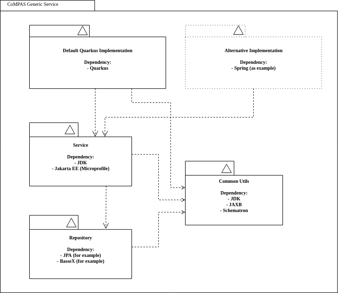

<!--
SPDX-FileCopyrightText: 2021 Alliander N.V.

SPDX-License-Identifier: CC-BY-4.0
-->

## Proposal for Generic Components

There is a discussion about which technology can be used, because not all companies are allowed to use the proposed 
technology choices, like Quarkus. But for some companies Quarkus is a needed technology to make the footprint smaller.

To make the code be used by as many companies as possible we can decide to set some ground-rules which libraries can 
be used in different part of the service. Below is an image of an example how a service can be build of. 



For instance the SCL Data Service has a Quarkus Rest Module, which uses the Service and Repository Module.
Every module is build separately, so that multiple artifacts are build and publish. The default container will
use Quarkus as Rest Interface to be implemented, but a company-specific implementation can be build, for instance
with Spring, but still uses larger parts of the module. 

For instance Quarkus is using the standard Jakarta EE, so a lot of work is done out-of-the-box.
Quarkus will use jandex to know which beans are available to be used.

Spring is using its own annotations, so there some extra configuration is needed to create all necessary bean
in a Spring Configuration class. Below is a example how to create a bean from a standard Java class.
```
@Configuration
public class ServiceConfiguration {
  @Bean
  @Autowired
  public SomeBeanClass createSomeBean(OtherDependingBean otherBean) {
    return new SomeBeanClass(otherBean);
  }
}
```

Because we are only using standard Java and Jakarta class both implementations can be used to run the standardized classes.