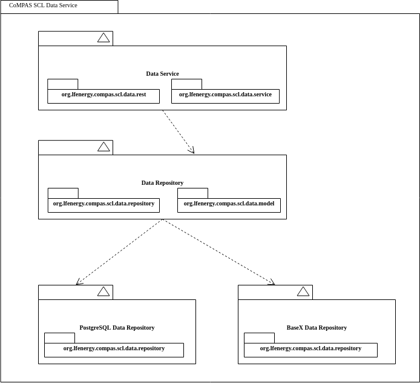
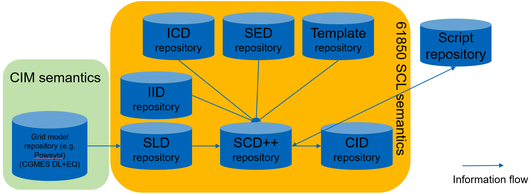

<!--
SPDX-FileCopyrightText: 2021 Alliander N.V.

SPDX-License-Identifier: CC-BY-4.0
-->

## CoMPAS SCL Data Service

### Introduction
The CoMPAS SCL Data Service is a rest interface that can be used to retrieve, store, update and delete 
SCL Configuration to different kind of database. 

### Components
The Service consists of a generic service layer with a rest interface on top. And a repository layer 
will be used to communicate with the storage. There will be different implementations available of
this repository layer.

### Rest interface
The request and response bodies of the rest calls use the format XML as content (not JSON), because the SCL is also written in XML. 

Depending on the environment where the component is running there is an OpenAPI UI available on "/openapi-ui/index.html" (for example "http://localhost:8080/openapi-ui/index.html").
The OpenAPI JSON can be retrieved on "/openapi" (for example "http://localhost:8080/openapi").

### Services
There are some main class with their methods as shown below. 

The CompasDataService Class is the generic part of the software. Then there are the repository classes.
The responsibility of the repository classes is to retrieve, store and delete entries from their storages.
Nothing more than that.

The Service class contains some logic regarding versions and private elements.
- findSCLByUUID: Retrieve the latest version of an SCL with a UUID for a specific type of SCL.
- createSCL: Stores a first version (1.0.0) of the SCL. Also adding the type and name as private elements to the SCL.
- updateSCL: Retrieve the latest version. Copy the private elements from that record. Add a historical record to the Header. 
  Determine the new version, using the latest version and ChangeSetType.
  Depending on if we want to keep historical versions of the SCL.
  - Keep history: Add the new SCP to the storage with the new version.
  - No history: Update the existing SCP in the storage.
- deleteSCL: Remove (all versions) of the SCL from the storage.

### BaseX
There a some Basex specific choices made in storing the SCL. 
- For every type of SCL a separate database is created. This is quite easy done in BaseX.
  
- In these databases the SCL will be stored as "\<uuid\>/\<major-version\>/\<minor-version\>/\<patch-version\>". 
  This way it will be easy to store the different version and find the latest version.
  Version part may be optional if no history will be saved.
  
### PostgreSQL
