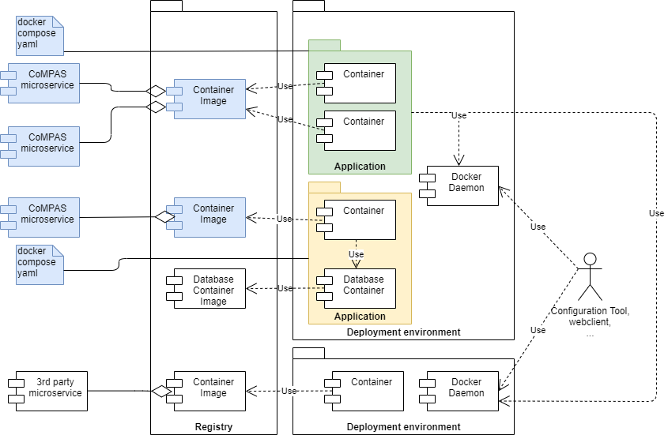

## Technical architecture

### Introduction
This section describes the deployment view of CoMPAS.

### Building and Deployment

The diagram above shows the deployment view. Blue components are within scope of the CoMPAS project.

**CoMPAS microservice**s are built from Java source code on Github (not shown) using the Gradle build proces. This results in a compiled java application. 

The result of the CI/CD is a **Container Image** in the Docker Registry. A **Container Image** contains one **CoMPAS microservice**. More than one CoMPAS microservice may be present in the image only if they are closely related and should be deployed and scaled together.

As part of the CI/CD proces a security scan is performed on the source code. The **Container Image**s must be signed and are the formal deliveries of the CoMPAS project.

In the deployment proces the **Container image** is deployed together with its dependencies (for example a database) in an **Application**. This deployment takes place using *Docker Compose*. For this a **docker compose yaml** file is supplied that deploys the application using Docker Compose.

Generally speaking, it is a good idea to deploy one thing per container. Reasons:
* Independent scaling: APIs scale differently than databases
* Independent update: update in isolation
* Supports different environments: a containerized database locally while managed service in production
* No need for a process magager

Third party microservices can be incorporated in an end user application or can be required for CoMPAS microservices, but this is out of scope for the project.

Deployment is done by the users of CoMPAS and out of scope for the project.

